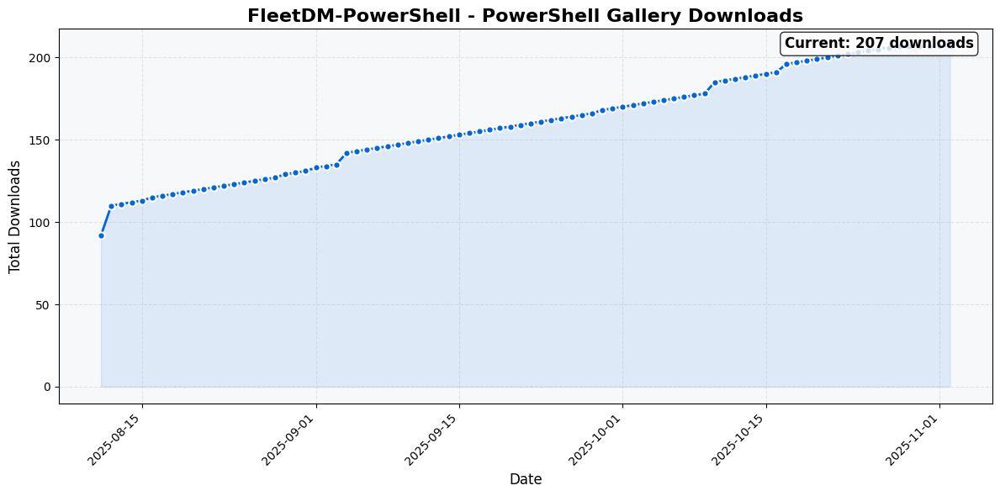

# FleetDM-PowerShell


A lightweight PowerShell module for interacting with the FleetDM Free Tier REST API.

[](https://github.com/Jorgeasaurus/FleetDM-PowerShell/actions/workflows/ci.yml)
[](https://jorgeasaurus.github.io/FleetDM-PowerShell/)
[](https://www.powershellgallery.com/packages/FleetDM-PowerShell)
[](https://www.powershellgallery.com/packages/FleetDM-PowerShell)
[](https://www.powershellgallery.com/packages/FleetDM-PowerShell)
[](https://github.com/Jorgeasaurus/FleetDM-PowerShell/releases/latest)
[](https://opensource.org/licenses/MIT)

## Overview

FleetDM-PowerShell provides a native PowerShell interface to FleetDM Free Tier, enabling administrators to manage hosts, queries, policies, and software inventory through familiar PowerShell cmdlets. This module focuses on FleetDM's free functionality without requiring Premium licenses or external dependencies.

## Download Statistics



📚 **[View Full Documentation](https://jorgeasaurus.github.io/FleetDM-PowerShell/)** - Comprehensive online documentation with detailed cmdlet reference

## Features

- **Free Tier Focus**: Designed specifically for FleetDM Free Tier (no Premium license required)
- **Host Management**: Query, filter, and manage FleetDM hosts
- **Query Execution**: Run live queries and saved queries against hosts
- **Policy Management**: Create, update, and monitor compliance policies
- **Software Inventory**: Track installed software and vulnerabilities (read-only)
- **Cross-Platform**: Works on Windows PowerShell 5.1+ and PowerShell Core 7+
- **Pipeline Support**: Full support for PowerShell pipeline operations
- **Simple Authentication**: Support for API tokens and credentials without external dependencies
- **Lightweight**: No SecretManagement or other complex dependencies
- **Comprehensive Help**: Detailed help for all cmdlets with examples

## Requirements

- PowerShell 5.1 or PowerShell Core 7.0+
- FleetDM server (4.0+) - Free Tier is sufficient
- FleetDM API token or credentials
- No external dependencies or Premium licenses required

## Installation

### From PowerShell Gallery

```powershell
Install-Module -Name FleetDM-PowerShell -Force
```

### From Source

```powershell
# Clone the repository
git clone https://github.com/Jorgeasaurus/FleetDM-PowerShell.git
cd FleetDM-PowerShell

# Import directly without building
Import-Module ./FleetDM-PowerShell.psd1 -Force
```

## Quick Start

### Connect to FleetDM

```powershell
# Using API token (recommended - most secure)
$token = ConvertTo-SecureString "your-api-token-here" -AsPlainText -Force
Connect-FleetDM -BaseUri "https://fleet.example.com" -ApiToken $token

# Using username/password
$cred = Get-Credential
Connect-FleetDM -BaseUri "https://fleet.example.com" -Credential $cred
```

### Basic Operations

```powershell
# Get all hosts
Get-FleetHost

# Get specific host
Get-FleetHost -Id 123

# Filter hosts by status
Get-FleetHost -Status online

# Run a live query and get results directly
$results = Invoke-FleetQuery -Query "SELECT * FROM system_info;" -HostId 1,2,3
$results.Results | Format-Table

# Or use a saved query
$results = Invoke-FleetSavedQuery -QueryId 123 -HostId 1,2,3

# Get policies
Get-FleetPolicy

# Get software inventory
Get-FleetSoftware -VulnerableOnly
```

## Available Cmdlets

For detailed help and examples, visit the **[Online Documentation](https://jorgeasaurus.github.io/FleetDM-PowerShell/)** or use `Get-Help <cmdlet-name> -Full`.

### Connection Management

- `Connect-FleetDM` - Establish connection to FleetDM server
- `Disconnect-FleetDM` - Disconnect from FleetDM server

### Host Management

- `Get-FleetHost` - Retrieve host information
- `Remove-FleetHost` - Remove hosts from FleetDM

### Query Management

- `Get-FleetQuery` - List saved queries
- `Invoke-FleetQuery` - Execute live queries
- `Invoke-FleetSavedQuery` - Execute saved queries with direct results

### Policy Management

- `Get-FleetPolicy` - Retrieve policies
- `New-FleetPolicy` - Create new policies
- `Set-FleetPolicy` - Update existing policies

### Software Management

- `Get-FleetSoftware` - Retrieve software inventory (read-only)

### Advanced

- `Invoke-FleetDMMethod` - Direct API access for unsupported endpoints

## Examples

### Example 1: Find and Remove Offline Hosts

```powershell
# Find hosts offline for more than 30 days
$offlineHosts = Get-FleetHost -Status offline | 
    Where-Object { $_.seen_time -lt (Get-Date).AddDays(-30) }

# Remove them (with confirmation)
$offlineHosts | Remove-FleetHost -Confirm
```

### Example 2: Check Policy Compliance

```powershell
# Get all policies with low compliance
Get-FleetPolicy | 
    Where-Object { $_.compliance_percentage -lt 80 } |
    Format-Table name, compliance_percentage, failing_host_count
```

### Example 3: Find Vulnerable Software

```powershell
# Get all software with critical vulnerabilities
Get-FleetSoftware -VulnerableOnly | 
    Where-Object { $_.highest_severity -eq 'critical' } |
    Sort-Object hosts_count -Descending |
    Select-Object name, version, hosts_count, cve_count
```

### Example 4: Run Query on Specific Platform

```powershell
# Get Ubuntu hosts and run a query
$ubuntuHosts = Get-FleetHost | Where-Object { $_.platform -eq 'ubuntu' }
$results = Invoke-FleetQuery -Query "SELECT * FROM os_version;" -HostId $ubuntuHosts.id

# View the results
$results.Results | ForEach-Object {
    Write-Host "Host: $($_.HostId)"
    $_.Rows | Format-Table
}
```

### Example 5: Create macOS Security Policy

```powershell
# Create a policy to check FileVault auto-login is disabled on macOS
New-FleetPolicy -Name "FileVault Auto-Login Disabled" `
    -Query "SELECT 1 FROM managed_policies WHERE domain = 'com.apple.loginwindow' AND name = 'DisableFDEAutoLogin' AND value = 1 LIMIT 1;" `
    -Platform darwin
```

### Example 6: Bulk Policy Creation

```powershell
# Import policies from CSV
Import-Csv policies.csv | ForEach-Object {
    New-FleetPolicy -Name $_.Name -Query $_.Query -Description $_.Description
}
```

## Pipeline Support

All cmdlets support pipeline operations:

```powershell
# Chain operations - get online Windows hosts
Get-FleetHost -Status online | 
    Where-Object { $_.platform -eq 'ubuntu' } |
    Select-Object id, hostname, seen_time

# Execute query on filtered hosts
$hostIds = Get-FleetHost | 
    Where-Object { $_.platform -eq 'debian' } |
    Select-Object -First 5 -ExpandProperty id
Invoke-FleetQuery -Query "SELECT * FROM system_info;" -HostId $hostIds

# Or pipe host IDs directly as an array
@(17,6,8) | Invoke-FleetQuery -Query "SELECT * FROM os_version;"
```

## Error Handling

The module provides detailed error messages and supports standard PowerShell error handling:

```powershell
try {
    Get-FleetHost -Id 99999
}
catch {
    Write-Error "Failed to get host: $_"
}
```

## Authentication

### API Token (Recommended)

The most secure method is using API tokens:

1. Generate an API token in FleetDM UI (Account → Get API Token)
2. For API-only users: `fleetctl user create --api-only`
3. Store token securely using SecureString
4. Tokens don't expire unless explicitly revoked

```powershell
# Store token securely
$token = Read-Host "Enter API Token" -AsSecureString
Connect-FleetDM -BaseUri "https://fleet.example.com" -ApiToken $token
```

### Username/Password

Less secure but available when tokens aren't accessible:

```powershell
$cred = Get-Credential
Connect-FleetDM -BaseUri "https://fleet.example.com" -Credential $cred
```

## Security Best Practices

1. **Never hardcode tokens** in scripts or source control
2. **Use SecureString** for token storage
3. **Create API-only users** for automation (requires admin access)
4. **Rotate tokens regularly**
5. **Use least-privilege principles** for API users

## Development

For developers who want to contribute or modify the module:

```powershell
# Clone the repository
git clone https://github.com/Jorgeasaurus/FleetDM-PowerShell.git
cd FleetDM-PowerShell

# Import the module directly from source
Import-Module ./FleetDM-PowerShell.psd1 -Force

# Make your changes and test them
```

## Testing

Run the Pester tests:

```powershell
# Run all tests
Invoke-Pester

# Run specific test file
Invoke-Pester -Path .\Tests\Get-FleetHost.Tests.ps1

# Run with code coverage
Invoke-Pester -CodeCoverage @('Public\*.ps1', 'Private\*.ps1')
```

## Limitations

- **Free Tier Only**: This module is designed for FleetDM Free Tier and does not support Premium features
- **No Software Installation**: Software installation requires FleetDM Premium license
- **WebSocket connections**: Live query results are not available via REST API (FleetDM limitation)
- **Direct query results**: Only available when targeting specific host IDs
  - Queries using `-Label` or `-All` return campaign info only
- **Query result retrieval**: Has a timeout limit (default 25 seconds)
- **No persistent sessions**: Authentication is session-based without saved credentials

## Troubleshooting

### Connection Issues

```powershell
# Test connection
Test-NetConnection -ComputerName fleet.example.com -Port 443

# Enable verbose output
Connect-FleetDM -BaseUri "https://fleet.example.com" -ApiToken $token -Verbose
```

### SSL/TLS Issues

```powershell
# For self-signed certificates (not recommended for production)
[System.Net.ServicePointManager]::ServerCertificateValidationCallback = {$true}
```

### Module Import Issues

```powershell
# Force reload module
Remove-Module FleetDM-PowerShell -Force -ErrorAction SilentlyContinue
Import-Module FleetDM-PowerShell -Force -Verbose

# Or import directly from source
Import-Module ./FleetDM-PowerShell.psd1 -Force
```

## Contributing

Contributions are welcome! Please:

1. Fork the repository
2. Create a feature branch (`git checkout -b feature/AmazingFeature`)
3. Commit your changes (`git commit -m 'Add some AmazingFeature'`)
4. Push to the branch (`git push origin feature/AmazingFeature`)
5. Open a Pull Request

### Development Guidelines

- Follow PowerShell best practices
- Add Pester tests for new functionality
- Update documentation and examples
- Ensure backward compatibility
- Use approved PowerShell verbs

## CI/CD Pipeline

The project uses GitHub Actions for continuous integration:

- **Build**: Runs on Windows, Linux, and macOS
- **Tests**: Automated Pester tests (98%+ pass rate achieved)
- **Analysis**: PSScriptAnalyzer checks
- **Publishing**: Automatic deployment to PowerShell Gallery on version tags

## License

This project is licensed under the MIT License - see the [LICENSE](LICENSE) file for details.

## Author

- **Jorge Suarez** - [Jorgeasaurus](https://github.com/Jorgeasaurus)

## Acknowledgments

- FleetDM team for the excellent API documentation
- PowerShell community for best practices and patterns
- Contributors and testers

## Documentation

- **📚 Full Documentation**: [https://jorgeasaurus.github.io/FleetDM-PowerShell/](https://jorgeasaurus.github.io/FleetDM-PowerShell/)
- **Built-in Help**: Use `Get-Help <cmdlet-name> -Full` for detailed cmdlet documentation
- **Interactive Viewer**: Run `./Show-Documentation.ps1` for local documentation browsing

## Support

- **Issues**: [GitHub Issues](https://github.com/Jorgeasaurus/FleetDM-PowerShell/issues)
- **FleetDM Docs**: [https://fleetdm.com/docs](https://fleetdm.com/docs)
- **PowerShell Gallery**: [FleetDM-PowerShell](https://www.powershellgallery.com/packages/FleetDM-PowerShell)

## Version History

### 1.0.0 - Initial Release

- Core host, query, policy, and software management
- Full pipeline support
- Cross-platform compatibility
- Secure authentication with API tokens
- Comprehensive test coverage
- CI/CD pipeline with GitHub Actions

## Roadmap

- [x] **Free Tier Focus**: Module optimized for FleetDM Free Tier users
- [x] **Simplified Authentication**: Removed complex SecretManagement dependencies
- [x] **High Test Coverage**: Achieved 98%+ test pass rate
- [ ] Add more granular error handling
- [ ] Add performance optimizations for large fleets
- [ ] Create advanced reporting cmdlets
- [ ] Add support for additional Free Tier features as FleetDM evolves
